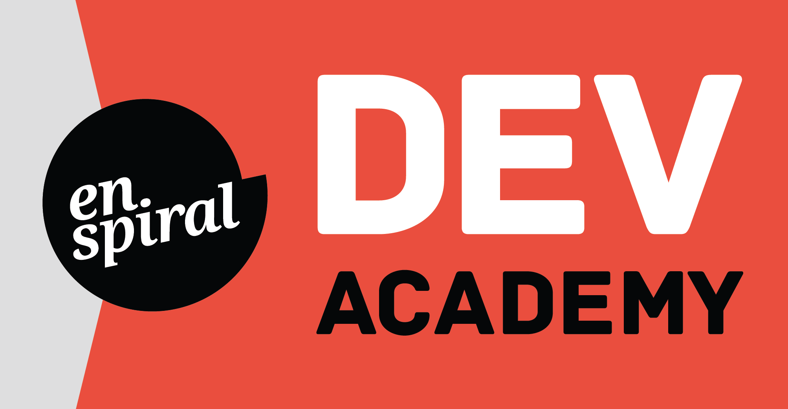

# A Day in the Life

Welcome to Enspiral Dev Academy!

We run the Day in the Life events for a couple of reasons. You'll have a chance to learn a bit about web development from your current level of experience. You'll also get a taste of what it's like to attend the Enspiral Dev Academy if you'd like to continue your learning and explore a career in software development. 

We're crazy about web development and improving people's lives with technology. We're also passionate about making the software development industry the best it can be. We think one way to do that is to increase the diversity of the people in that industry. We hope these events will give a wide range of people the evidence they need to know they might have the ability to make a difference in the lives of others through software.

If you've never done any kind web development or programming we'll take you though some of the basics of HTML and CSS, two of the fundamental languages of the web. By the end of the day you'll use your creativity to build a custom web page from scratch, from code.

If you've done a bit of HTML and CSS or dabbled with other programming languages, we'll introduce you to JavaScript and jQuery to build an interactive racing game. Once the basic mechanics are in place, you can add sound, images and make it your own.

At the end of the day, everyone will have a chance to show off their creations.

> If you want to be a _good_ programmer, study computers. If you want to be a _great_ programmer, study people. And if you want to be an _really great_ programmer, study yourself.

The act of writing code is only one facet of being a software developer. If you want to do anything meaningful, you need a group of people. A lot of what we do at Dev Academy is help people more successful in a team. We've also found learning a new skill, especially one as challenging as programming, can cause you to question your own capabilities and worthiness. This can be a huge detriment to learning. Our Engineering Empathy curriculum addresses the people and self related tools that make us more effective on teams and in our own heads.

To round out our whole-person approach to learning we also include yoga twice a week and a lot of opportunities to enjoy each other's company.

Unfortunately we aren't able to share all of the aspects of the Dev Academy experience, but we try to fit in as much as we can in the Day in the Life events. We hope you have a great time and come back and visit.
